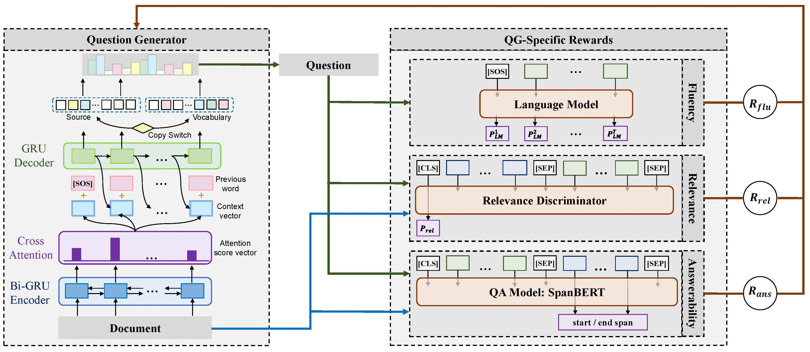

# Exploring Question-Specific Rewards for Generating Deep Questions

This repository contains codes and models for the paper: [Exploring Question-Specific Rewards for Generating Deep Questions (COLING 2020)](). Below is the framework of our proposed model.



## Requirements

#### Environment

```
pytorch 1.4.0
nltk 3.4.4
numpy 1.18.1
tqdm 4.32.2
```

#### Data Preprocessing & Models

* download (here)[https://drive.google.com/file/d/10cgNwWGB_rdE3YVu78_qdEjl3LgIHThL/view?usp=sharing]

* ***Coming Soon***

#### Models

* ***Coming Soon***

## Training

* run [`scripts/train_example.sh`](https://github.com/YuxiXie/RL-for-Question-Generation/blob/main/scripts/train_example.sh) to train the ensemble model which utilizes all three rewards.

## Translating

* run  [`scripts/translate_example.sh`](https://github.com/YuxiXie/RL-for-Question-Generation/blob/main/scripts/translate_example.sh) to get the prediction on the validation dataset.

## Evaluating

We take use of the [Evaluation codes for MS COCO caption generation](https://github.com/salaniz/pycocoevalcap) for evaluation on automatic metrics.

  - To install pycocoevalcap and the pycocotools dependency, run:

```
pip install git+https://github.com/salaniz/pycocoevalcap
```

  - To evaluate the results in the translated file, _e.g._ `prediction.txt`, run:

```
python evaluate_metrics.py prediction.txt
```

## Citation
```
    @inproceedings{xie-etal-2020-RLQG,
      title = {Exploring Question-Specific Rewards for Generating Deep Questions},
      author = {Xie, Yuxi and Pan, Liangming and Wang, Dongzhe and Kan, Min-Yen and Feng, Yansong},
      booktitle = {The 28th International Conference on Computational Linguistics (COLING 2020)},
      year = {2020}
    }
```
